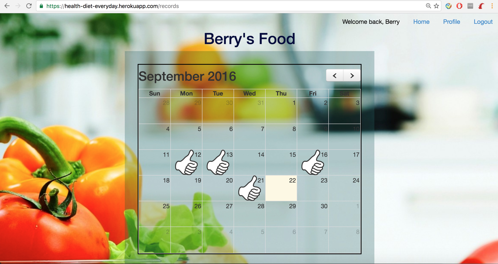
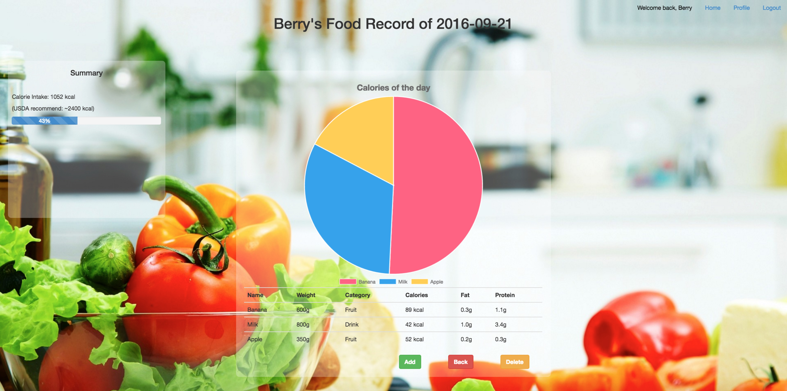
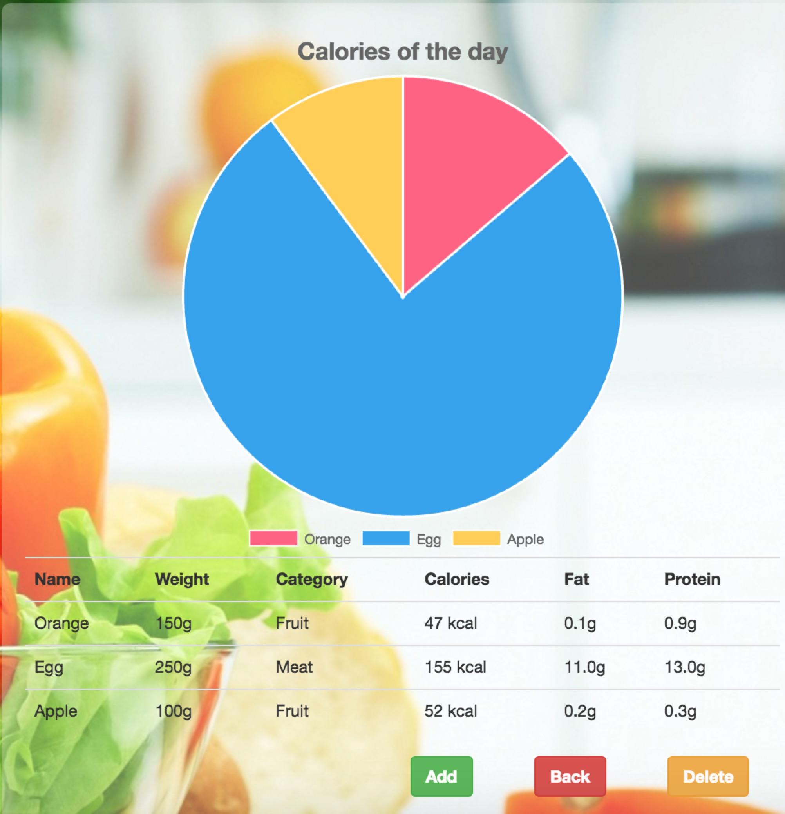
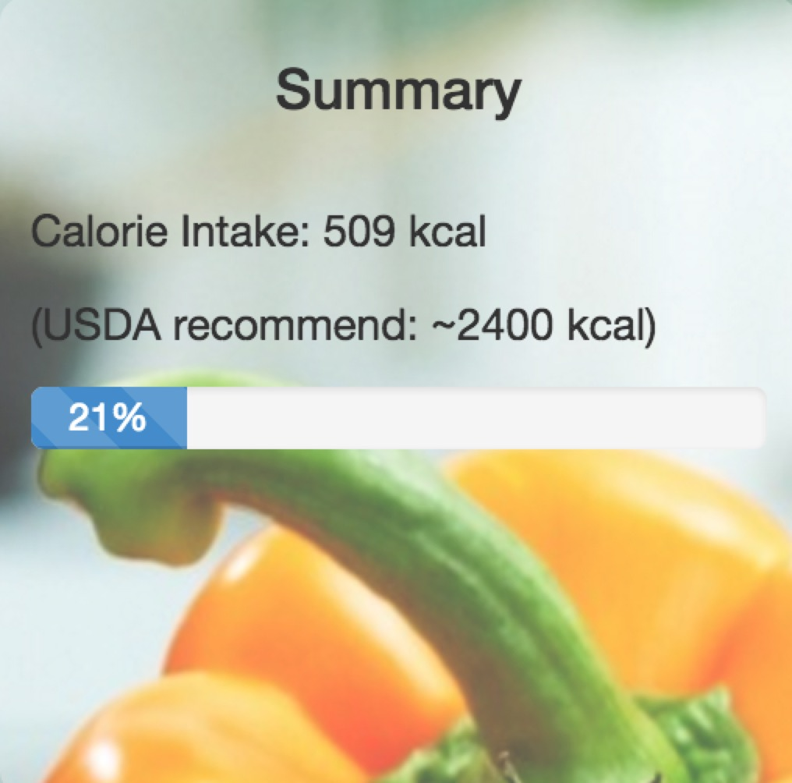
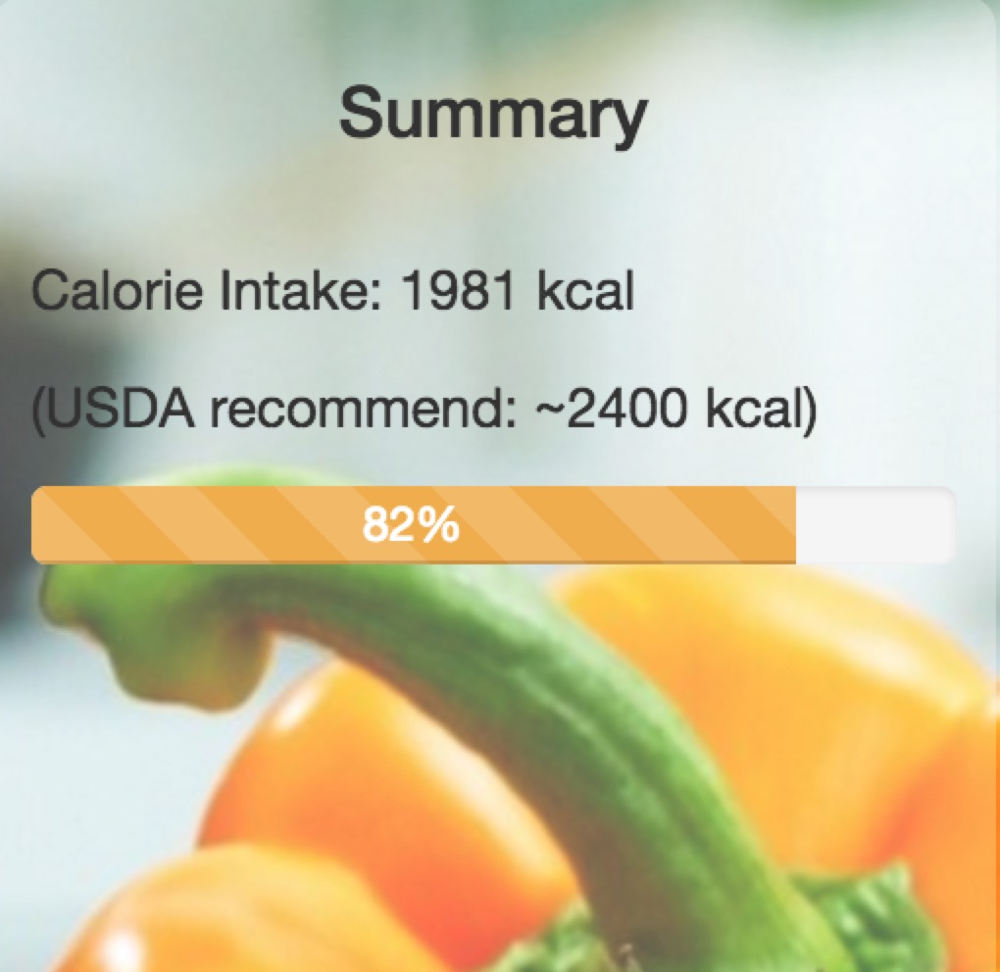
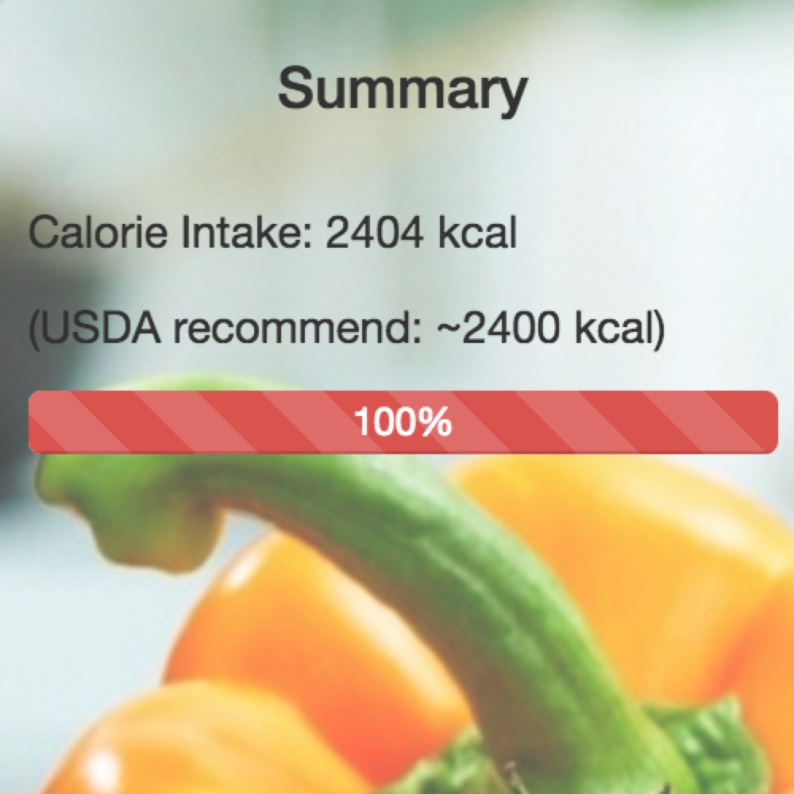

**Health diet everyday**  :watermelon:  
====

### *—— web app help you keep health* :smile:  
  
 

## Using  :dizzy:
Visit [Application homepage on heroku](https://health-diet-everyday.herokuapp.com/).  

## Instructions :wrench:

### 1. _Sign In/Up_

#### First Time Users

First time user must start with [**Sign up**][signup_link]. Please enter your _**username**_ (Not for login), _**email address**_ (For login), **_password_** (**Caution:** Password could _**not**_ be reset or changed! So please memorized it!), and _**date of birth**_. These infomation are _**required**_ to sign up successfully.    
  
#### Return Users

[**Sign In**][signin_link] with your email and password.

### 2. _Profile_  :octocat:
After login in, you would be able to view records in profile. 

#### Records  :notebook:  
Each record contains data of portions and the date.  

* **Create** :+1:  
 * Click Add Button.
 * Enter the date(__Required__).
 * Click Create Button.
* **Edit**  :black_nib:  
 The date of record could not be edit.
* **Show**  :point_right:  
 Click date in list of records or in calendar would both allow you reviewing the record.
* **Destroy**  :no_good:  
 Destroy the record would erase *ALL* portions in that record. **_BE CAREFUL_**, such operation __could not__ rollback.

#### Portions :hamburger:  
Each portion contains data of food, the weight of intake and it's parent record's id.

* **Create** :+1: 
 * Click _Add_ Button.
 * Select _food category_ first.
 * Then select _food_ under that category.
 * Enter the _weight intake_(__Required__).
 * Click Create Button.
* **Destroy**  :no_good:  
 Click the portion in the table and confirm the execution. As a reminder, this operation __could not__ rollback.

#### Pie Chart  :bar_chart:  

The pie chart indicates the percentage of Calorie contributed by various portions.

 

#### Progress Bar

The progress bar notifies the users total calorie intake. The baseline is 2400 kcal as recommended by USDA. The color of progress bar would change.  

* Light blue in normal status:  
   
* Yellow in case of approching baseline:  
     
* Red in case of exceeding:  
   
 
## Language/Library Used  :book:  
* **HTML5**
* **css3/SaSS**
* **Bootstrap(v3.2.0)**
* **Javascript(ES2015)/Jquery(v3.1.0)**
* **Ruby(v2.2.3) on Rails(v4.2.7)**
* **PostgreSQL** :elephant:  

## Plugins Used
* **Chart.js**   
   
[  Source:]() [**Docs**](http://www.chartjs.org/docs/) [**GitHubs**](https://github.com/chartjs/Chart.js/releases/tag/v2.3.0-rc.1)
* **FullCalendar**   
   
[  Source:]() [**Docs**](https://fullcalendar.io/docs/) [**GitHubs**](https://github.com/fullcalendar/fullcalendar)
* **Moment.js**  
   
[  Source:]() [**Docs**](http://momentjs.com/docs/) [**GitHubs**](https://github.com/moment/moment/)

[signup_link]: https://health-diet-everyday.herokuapp.com/users/new
[signin_link]: https://health-diet-everyday.herokuapp.com/login  
